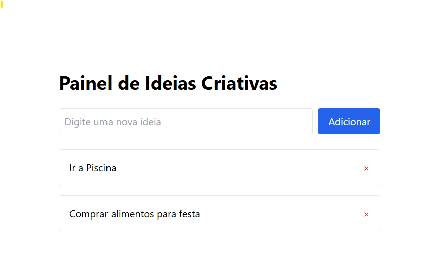

# 🧠 Painel de Ideias Criativas

Este é um projeto web que permite registrar, visualizar e remover ideias criativas!  
Desenvolvido com **React**, **TailwindCSS**, **Express** e **Docker**.


## 🖼️ Preview do Projeto



## ✨ Funcionalidades

- ✅ Adicionar novas ideias
- 🗑️ Remover ideias
- 🧠 Interface intuitiva e minimalista
- 🔄 Atualização dinâmica da lista
- 🐳 Executável via Docker e Docker Compose

## 🚀 Como rodar com Docker

1. Clone o repositório:
   ```bash
   git clone https://github.com/seu-usuario/creative-board.git
   cd creative-board

2. Construa e inicie os containers:
```bash
    docker-compose up --build
```
3. Acesse:    
    Frontend: http://localhost:5173

    Backend API: http://localhost:4000/ideas

## 🧩 Tecnologias
React + Vite

Tailwind CSS

Express.js

Docker + Docker Compose

## 📂 Estrutura de Pastas
graphql
Copiar código
creative-board/
├── frontend/         # Interface com React
├── backend/          # API REST com Express
├── assets/           # Imagens para o README
├── docker-compose.yml
└── README.md